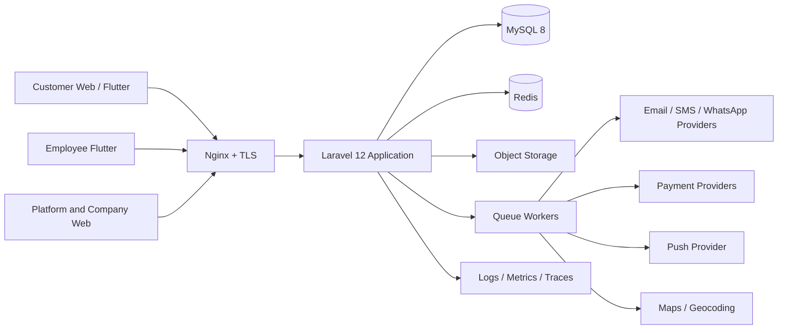
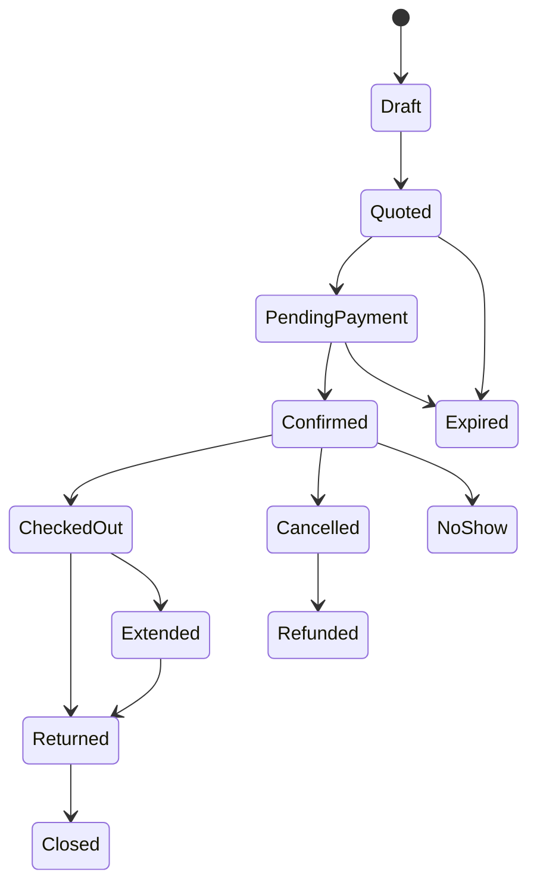

# Architecture

## System topology

VoyagerRent is a modular Laravel application with a server-rendered web console, a versioned JSON API, and two Flutter clients. The platform intentionally uses a **single MySQL database with shared tables** because marketplace discovery requires controlled cross-tenant reads while company operations require strict tenant-scoped writes. Tenant context is resolved at the request boundary and remains explicit in every model, query, job, policy, cache key, export, and file path.

## Module boundaries

The application is divided by business capability rather than request type. Controllers only authenticate, authorize, validate, call an action or service, and return a Resource or Livewire response. Services orchestrate transactional work. Domain events represent completed state transitions. Listeners create non-critical side effects through the queue. Repositories are used only where a query crosses aggregate boundaries or requires a dedicated read model.

| Module | Owns | Key invariants |
| --- | --- | --- |
| Tenancy | Companies, plans, subscriptions, commission settings, tenant context | No company-owned resource may exist without `company_id`; disabled tenants cannot create or modify operational data |
| Access | Users, roles, permissions, device sessions, MFA records | A user action must be both authenticated and permitted in the active scope |
| Inventory | Branches, vehicle groups, vehicles, availability blocks, media | A vehicle cannot be assigned to conflicting reservations or maintenance blocks |
| Pricing | Rate plans, season rules, demand rules, fees, taxes, promotions | Quote totals are reproducible from an immutable pricing snapshot |
| Reservations | Quotes, bookings, amendments, cancellations, contracts, signatures | A booking transition is transactional, auditable, and guarded by state-machine rules |
| Finance | Wallets, ledgers, payments, refunds, invoices, expenses | Monetary amounts are integers in minor units; ledger postings are append-only |
| Operations | Inspections, damages, maintenance, handover tasks | Check-out and return are linked to inspections with evidence and actor attribution |
| Communications | Notification templates, deliveries, support tickets, conversations | Provider delivery is asynchronous and idempotent; message templates are locale-aware |
| Platform | CMS, SEO, advertisements, commission settlement, global support | Cross-tenant access is restricted to platform roles and independently audited |

## Tenant isolation controls

Tenant safety is implemented in layers. A `TenantContext` is established by API token, authenticated web session, host mapping, or an explicit platform administrator impersonation grant. The context is immutable per request. The `BelongsToCompany` trait adds a global Eloquent scope and automatically sets `company_id` on writes. Policies additionally verify company membership. SQL joins remain tenant-aware through explicit `whereCompany()` constraints, and background jobs serialize the company identifier and re-establish context before execution.

| Layer | Control | Failure response |
| --- | --- | --- |
| HTTP middleware | Resolves active company and rejects ambiguous scope | 403 or 422 without resource disclosure |
| Model global scope | Adds `company_id` predicate to tenant models | Empty result rather than cross-tenant retrieval |
| Policy | Verifies membership, role and permission | 403 authorization error |
| Request validation | Confirms referenced IDs belong to current company | 422 validation error |
| Job middleware | Restores and verifies tenant before handling | Failed job with alert and audit event |
| Storage path | Prefixes private objects by company UUID | Object cannot be addressed outside its namespace |
| Cache keys | Prefixes by company UUID and version | Cache reads cannot bleed between companies |
| Audit trail | Captures actor, tenant, impersonator, source and correlation ID | Investigation-ready immutable record |

## Reservation state machine

Reservation status transitions are restricted by the `ReservationState` enum and service-level transition map. Each transition is wrapped in a database transaction with row locks on the reservation and associated availability interval.

A quoted reservation has a time-limited price and availability hold. A confirmed reservation holds a durable inventory allocation. A cancellation calculates fees from the frozen policy snapshot, then generates a refund instruction when money has been captured. Reschedules use a compensating workflow: create and validate a replacement allocation, apply any payment delta, then release the original allocation in the same transaction.

## Reliable external work

Database changes and outbound effects are decoupled through a transactional outbox. Services persist domain events in the same transaction as the business change. A worker delivers unpublished outbox messages with a stable idempotency key; provider callbacks are also stored idempotently. This prevents lost confirmation emails, duplicated refunds, and inconsistent notification state when a process restarts.

| Concern | Design |
| --- | --- |
| Long-running work | Redis queues segregated by `critical`, `billing`, `notifications`, `exports`, and `default` |
| Duplicate safety | Provider and job idempotency keys; unique event keys; request idempotency middleware for mutation APIs |
| Retries | Exponential backoff with bounded attempts; poison messages enter failed-job review |
| Scheduled work | Laravel scheduler executes expiry, waitlist promotion, invoice generation, reminders, retention, and analytics snapshots |
| Observability | Structured JSON logs with correlation IDs, queue metrics, exception alerting, health endpoints, and audit queries |

## Data classification

Personal data and documents are private by default. Government identification, driving licences, signatures, payment references, and damage images use access-checked private storage. Payment card data is never stored; only provider tokens, payment method metadata, and transaction references are retained. Contract PDFs are immutable once signed and are linked to the exact booking, template version, signer identity, timestamp, IP address, and signature evidence.

## Availability algorithm

Availability is determined from vehicle group capacity, confirmed allocations, temporary quote holds, maintenance blocks, branch operating hours, pickup/return geography, and company policies. Queries use half-open time intervals (`start < requested_end AND end > requested_start`) to eliminate boundary collisions. Each confirmed allocation is protected by a transaction and a unique allocation identity; capacity updates occur under locks to prevent overselling during concurrent checkout.
