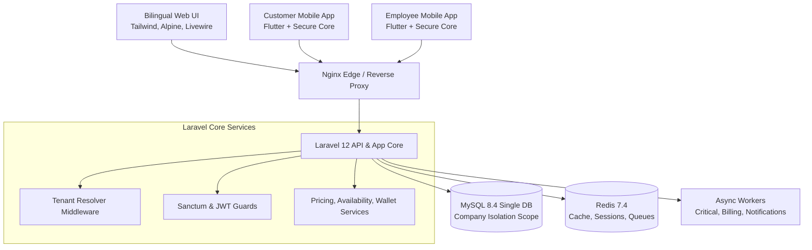
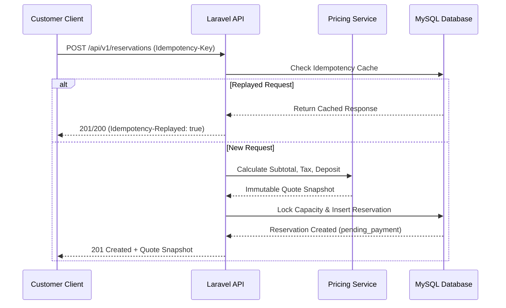
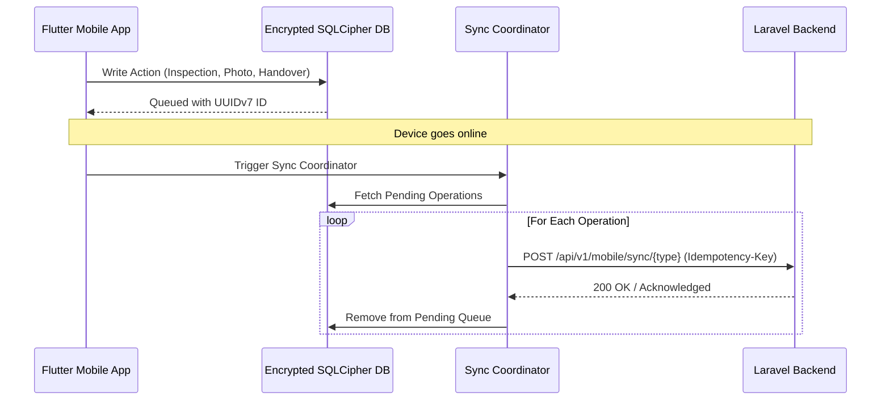

# Architecture and Process Diagrams

This document contains Mermaid diagrams illustrating the VoyagerRent platform architecture, single-database multi-tenant isolation, reservation lifecycle, and mobile offline synchronization.

## 1. System Architecture

## 2. Reservation & Idempotency Lifecycle

## 3. Mobile Offline Synchronization

